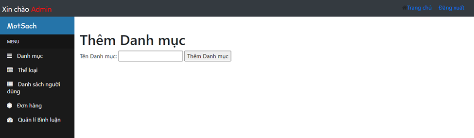
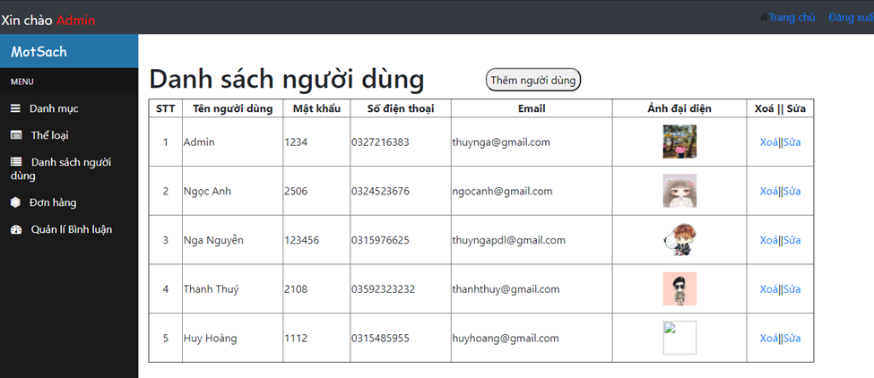

# WEBSITE SELLING BOOKS ONLINE
Building a website to sell books online is aimed at helping customers order books quickly, conveniently, and at a lower cost. Customers can choose a book of their preference from a vast repository of knowledge, which includes thousands of books spanning various genres.

## Installation Guide
- Installing Xampp: You can download the latest version. Link download: https://www.apachefriends.org/download.html

## System Requirements
- Utilize programming languages: PHP, HTML, CSS, JAVASCRIPT.
- MySQL database.

## System Functions
* **Admin:**
    - Login: Manage the entire system.
    - Manage book categories: such as adding, deleting, and editing information about book types, authors, and categories.
    - Order management: Process and handle orders, handle payments, and arrange delivery to customers.
    - Book management: Add, edit, delete information about books, update quantities in stock, and indicate if a book is in or out of stock.
    - Monitor the list of customer feedback.
* **User:**
    - First, customers need to register for an account, and then log in to the system.
    - Search: Customers can search for the desired book by title, author's name, or genre.
    - They can view detailed information about a book (content, genre, author's name).
    - Customers can add a book to their shopping cart by making a purchase and view other details.
    - Manage their placed orders and provide feedback and ratings to the Admin.

## Demo
Home Page
 
Bestselling Books Page

Shopping Cart Page

Order Page

Registration Page

Login Page

Admin Home Page

Category Management Page

Genre Management Page

Book Product Management Page

User Management Page

Comment Management Page

Order Management Page

